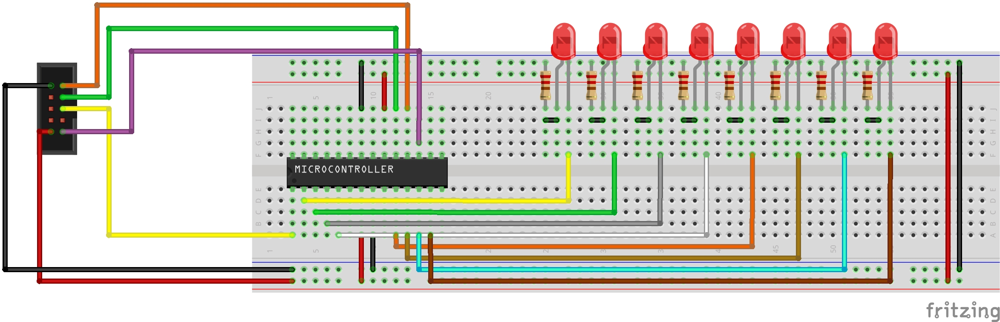

# Atmega8A - LED effects

Trying to configure VSCode to work with AVR microcontrolers and create some visual effects.

## Configuration

To work you need:
- Hardware
  - one of AVR microcontroler (e.g. ATmega8), 
  - usbasp programmer, 
  - breadbord and wires,
  - LEDs and resistors.
  
- Software
  - avrdude,
  - AVR-GCC compiler,
  - AVR Libc.

    Instalation for Fedora:

    ```Bash
    sudo dnf install avr-gcc avr-libc avrdude
    ```


Connect everything like on the picture:


This is minimum connecting setup without capacitors on power supply, resistor on reset pin, and external oscilator.

I decide to set internal oscilator to maximum value 8MHz. To do this you need to set fusebits.

```Bash
avrdude -c usbasp -p m8 -U lfuse:w:0xE4:m -U hfuse:w:0xD9:m
```


## Launching program

If everything is connected corectly and all software stuff are installed you only need to run script.

```Bash

sh run.sh
```